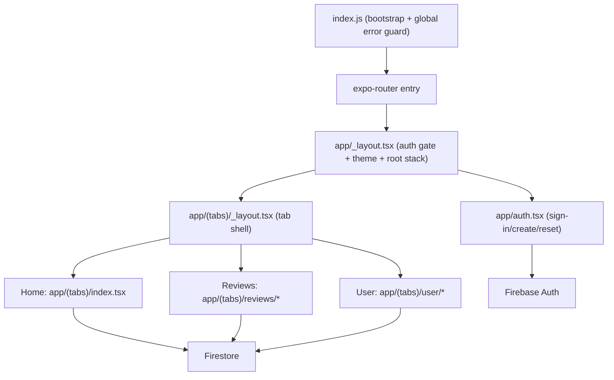

# Review Budz Developer Guide

This document describes how the app is built and operated today.

## 1. System Overview

Review Budz is an Expo Router React Native app with Firebase Auth + Firestore.

- Runtime: Expo SDK 54, React Native 0.81, Hermes, TypeScript (strict mode).
- Navigation: file-based routes via `expo-router`.
- Data/auth: `@react-native-firebase/auth` and `@react-native-firebase/firestore`.
- UI model: tab shell (`Home`, `Reviews`, `User`) with nested stack routes.
- Build system: EAS Build (`development`, `preview`, `production`) and native iOS/Android projects checked in.

## 2. Architecture

### 2.1 High-level architecture

### 2.2 Boot and startup resilience

Boot path:

1. `index.js` enables `react-native-screens` optimizations early and installs a global JS error guard.
2. A bootstrap shell is registered immediately so startup failures still render fallback UI.
3. `expo-router/entry` is required in a guarded `try/catch`.
4. `app/_layout.tsx` hides splash, waits for auth resolution, and gates navigation.

Important files:

- `index.js`: bootstrap shell, splash fallback, global error capture.
- `app/_layout.tsx`: auth state listener and route redirect logic.
- `ios/mcreview/AppDelegate.swift`: native fatal handlers and launch diagnostics logging.

### 2.3 Routing tree

Route groups are hidden in URLs by Expo Router.

- `/auth`
- `/` (tab home)
- `/reviews`
- `/reviews/:flowerId`
- `/reviews/product/:productId` (legacy redirect to `/reviews/:productId`)
- `/user`
- `/user/about`
- `/user/legal`
- `/user/reviews-info`
- `/user/edit-profile`
- `/user/change-email`
- `/user/feedback`
- `/user/delete-account`
- `/user/profile/:uid`

## 3. Code Ownership (By Folder/File)

Use this as the ownership map for triage and review routing.

| Paths | Owner domain | Responsibility |
|---|---|---|
| `index.js`, `app/_layout.tsx`, `app/(tabs)/_layout.tsx` | Platform Shell | App bootstrap, route gating, root navigation behavior |
| `app/auth.tsx`, `lib/nativeDeps.ts` | Auth & Session | Sign-in/create/reset, session readiness, native dependency loading |
| `app/(tabs)/index.tsx`, `components/home/*` | Home Feed | Community feed cards, trending/updated/badge subscriptions |
| `app/(tabs)/reviews/index.tsx`, `app/(tabs)/reviews/[flowerId].tsx`, `app/(tabs)/reviews/product/[productId].tsx`, `app/(tabs)/reviews/_layout.tsx` | Reviews Domain | Product discovery, review CRUD, helpful/report/favorite flows |
| `components/ui/CinematicCard.tsx`, `components/ui/JazzBudRating.tsx` | Shared Reviews UI | Reusable visual primitives used across feed/reviews |
| `app/(tabs)/user/index.tsx`, `app/(tabs)/user/profile/[uid].tsx`, `app/(tabs)/user/edit-profile.tsx`, `app/(tabs)/user/change-email.tsx`, `app/(tabs)/user/delete-account.tsx` | Profile & Account | Profile display/edit, account actions, export/delete lifecycle |
| `app/(tabs)/user/about.tsx`, `app/(tabs)/user/legal.tsx`, `app/(tabs)/user/reviews-info.tsx`, `app/(tabs)/user/feedback.tsx` | Product Content | Static informational screens and feedback UX |
| `lib/theme.ts`, `lib/typography.ts`, `components/AppBackground.tsx` | Design System | Theme tokens, typography, global backgrounds |
| `firestore.rules`, `scripts/*`, `data/*` | Data Platform | Firestore policy, import/patch/purge operations, data shaping |
| `app.json`, `eas.json`, `plugins/withIosNonModularHeaders.js`, `ios/*`, `android/*` | Release Engineering | Build config, native wiring, deployment readiness |
| `docs/*` | Documentation | Operational and developer documentation |

Optional: mirror this table into a `CODEOWNERS` file using your actual team/user handles.

## 4. Firestore Data Model and Access Rules

### 4.1 Collections used by app code

- `products/{productId}`
  - Read: public
  - Write: admin only
  - Key fields used: `name`, `maker`, `variant`, `type`, `strainType`, `productType`, `thcPct`, `cbdPct`, `terpenes`
- `users/{uid}`
  - Read: signed-in users
  - Create/update/delete: self (admin protected field) or admin
  - Key fields used: `displayName`, `isAdmin`, `favoriteProductIds`, `avatarId`, `photoURL`, `bio`, timestamps
- `users/{uid}/favorites/{productId}`
  - Key fields: `productId`, `slots`, `updatedAt`
- `users/{uid}/helpful/{reviewId}`
  - User-specific helpful vote documents
- `users/{uid}/reportedReviews/{reviewId}`
  - User-specific report/hide records
- `reviews/{reviewId}`
  - Read: public
  - Create: signed-in user, `userId` must match auth UID, `rating` 1..5
  - Update/delete: owner or admin
  - Key fields: `productId`, `userId`, `rating`, `score`, `text`, `helpfulCount`, effect scores, timestamps
- `reviewReports/{reportId}`
  - Create: signed-in user where `reporterUserId` matches auth UID
  - Read/update/delete: admin
- `badgeAwards` (read-only from app feed)
- `reviewHelpfulVotes` (legacy; still read in `user/index.tsx`)

Rules source: `firestore.rules`.

### 4.2 Security-rule implications in app behavior

- Helpful and report state is per-user and read from user subcollections.
- Admin powers are controlled by `users/{uid}.isAdmin`; clients cannot escalate this field.
- Public profile can show “Helpful given” only for self due subcollection read constraints.

## 5. Workflow Documentation

## 5.1 Auth flow

### Entry and gating

1. Root layout subscribes to `auth().onAuthStateChanged`.
2. Anonymous sessions are explicitly signed out.
3. If signed out, redirect to `/auth`.
4. If signed in and on `/auth`, redirect to `/(tabs)`.

### Sign in

1. User submits email/password in `app/auth.tsx`.
2. Last-used email is persisted in AsyncStorage (`lastEmail`).
3. `signInWithEmailAndPassword` is called.
4. On success, route to `returnTo` (if provided) or tabs root.

### Create account

1. `createUserWithEmailAndPassword`.
2. Set Auth profile display name to `"New Member"`.
3. Upsert Firestore `users/{uid}` with baseline profile:
   - `displayName`
   - `isAdmin: false`
   - `favoriteProductIds: []`
   - timestamps
4. Redirect to tabs root.

### Password reset

1. Uses entered email from auth screen.
2. Calls `sendPasswordResetEmail`.
3. Shows success/error alert.

## 5.2 Review flow

### Product list and filtering (`/reviews`)

1. Subscribe to `products` and normalize product fields.
2. Subscribe to `reviews` and derive per-product stats (`count`, `avg`, `latestReviewAtMs`).
3. Subscribe to user favorites (`users/{uid}` + `users/{uid}/favorites`).
4. Apply search and filters (strain, maker, terpene, favorite slots).
5. Navigate to `/reviews/:productId` on card tap.

### Product detail (`/reviews/:flowerId`)

1. Resolve `productId` from route params (`flowerId` or `productId`).
2. Subscribe to:
   - `products/{productId}`
   - `reviews where productId == ...`
   - user profile (`isAdmin`, legacy favorites)
   - user `favorites/{productId}`
   - user `helpful`
   - user `reportedReviews`
3. Load review author display names with batched `users where documentId in [...]`.
4. Compute robust product/review score fallbacks if no stored `score`.

### Write/edit review

1. Open modal for new or existing review (owner-only edit).
2. Build payload with rating/text/effect fields.
3. Write:
   - New: add doc with `helpfulCount: 0` + `createdAt`
   - Edit: update existing review doc
4. Trigger local 10-second cooldown to reduce rapid repeat actions.

### Helpful vote

1. Transaction reads review doc and user vote doc.
2. Prevent self-voting.
3. Toggle vote doc in `users/{uid}/helpful/{reviewId}`.
4. Increment/decrement `reviews/{reviewId}.helpfulCount` atomically.

### Report review

1. Prevent self-report.
2. Create moderation record in `reviewReports`.
3. Create user hide record in `users/{uid}/reportedReviews/{reviewId}`.
4. Reported reviews are filtered out for that user locally.

### Favorite slots

1. Toggle one of `general/daytime/afternoon/night`.
2. Persist per-product slots under `users/{uid}/favorites/{productId}`.
3. Mirror legacy array field `favoriteProductIds` with `arrayUnion/arrayRemove`.

## 5.3 User profile flow

### Self profile (`/user`)

1. Read current Auth user (display name, email, photoURL).
2. Subscribe to `users/{uid}` for avatar/join metadata.
3. Subscribe to user reviews for:
   - `reviewsWritten`
   - `helpfulReceived` (sum of review helpful counts)
   - recent top 5 reviews
4. Subscribe to `users/{uid}/favorites` and `users/{uid}/favourites` for count compatibility.
5. Subscribe to `reviewHelpfulVotes` for `helpfulGiven` (legacy path).
6. Allow:
   - avatar selection (writes `users/{uid}.avatarId`)
   - sign out
   - email change
   - export data
   - account deletion

### Public profile (`/user/profile/:uid`)

1. Load `users/{uid}` document for display data.
2. Load `reviews where userId == uid` to derive stats + recent activity.
3. Resolve recent review product names through batched product lookups.
4. If viewing own profile, include `users/{uid}/helpful` count; otherwise show private.

### Edit profile

1. Update Auth `displayName`.
2. Upsert Firestore `users/{uid}.displayName`.

### Change email

1. Prefer `verifyBeforeUpdateEmail` flow when available.
2. Fall back to `updateEmail`.
3. Handle “requires recent login” errors with re-auth guidance.

### Delete account

1. Best-effort purge of user-owned Firestore docs/subcollections.
2. Delete Auth user (`user.delete()`).
3. Redirect to `/auth`.

## 6. Build and Release Process

### 6.1 Prerequisites

- Node/NPM installed.
- EAS CLI authenticated for CI/release builds.
- Firebase config files present:
  - `firebase/GoogleService-Info.plist`
  - `firebase/google-services.json`

### 6.2 Local development

1. Install deps:
   - `npm install`
2. Start dev server:
   - `npm run start`
3. Run native:
   - iOS: `npm run ios`
   - Android: `npm run android`

### 6.3 EAS profiles (`eas.json`)

- `development`: dev client, internal distribution
- `preview`: internal distribution, auto increment
- `production`: auto increment

Typical commands:

- `eas build --platform ios --profile preview`
- `eas build --platform android --profile preview`
- `eas build --platform ios --profile production`
- `eas submit --platform ios --profile production`

### 6.4 Native/build configuration notes

- New architecture is disabled (`newArchEnabled: false`).
- Hermes is enabled on both platforms.
- iOS uses static frameworks and modular-header workaround plugin:
  - `plugins/withIosNonModularHeaders.js`
  - injected into `ios/Podfile` post-install.
- Android release currently uses debug signing config in `android/app/build.gradle`.
  - This is acceptable for internal testing but not for public Play Store release.

### 6.5 Release checklist

1. Validate Firestore rules and required indexes.
2. Smoke test auth, review CRUD, helpful/report, profile edit/delete.
3. Confirm Firebase files and bundle IDs/package IDs match target project.
4. Run preview EAS builds and test on device.
5. Promote to production profile and submit.

## 7. Data/Operations Scripts

Scripts live in `scripts/` and use `firebase-admin` with local `scripts/serviceAccountKey.json`.

- `importProducts.js`: bulk import `data/flowers_master.csv` into `products`.
- `importFlowers.js`: legacy import into `flowers`.
- `patchProductType.js`: backfill `productType`.
- `patchStrainTypeOverrides.js`: merge override strain types from CSV.
- `clearProducts.js`: delete all `products` docs (supports `--dry-run`).
- `purgeCommunityData.js --confirm`: destructive purge of community-generated Firestore data.

Safety note: scripts are operational tools; run only with the correct project service account.

## 8. Troubleshooting

### 8.1 Startup and module initialization

- Symptom: “Startup error detected” or “App startup failed”
  - Check `index.js` bootstrap guard and fatal message output.
  - iOS: inspect device logs from `ios/mcreview/AppDelegate.swift` (`[MC][Launch]` markers).
- Symptom: “Auth/Reviews/User screen unavailable”
  - Native Firebase modules did not load (`lib/nativeDeps.ts` returned `null`).
  - Reinstall app / rebuild dev client / verify native linking.

### 8.2 Auth issues

- Symptom: forced redirect to `/auth`
  - Expected if no signed-in user or session is anonymous.
- Symptom: email change/delete blocked
  - Firebase requires recent login for sensitive account actions.

### 8.3 Firestore permission/index issues

- Symptom: `permission-denied`
  - Validate writes align with `firestore.rules` constraints:
    - `reviews.userId` must match auth UID on create.
    - user subcollections are self-only.
    - `isAdmin` cannot be changed by non-admin clients.
- Symptom: query fails with missing index
  - Likely compound query requiring Firestore index (for example `where + orderBy` patterns).

### 8.4 Review/engagement inconsistencies

- Symptom: `Helpful given` differs between screens
  - `user/index.tsx` reads legacy `reviewHelpfulVotes`; detail/public profile logic uses `users/{uid}/helpful`.
  - Standardize on one source to avoid divergence.
- Symptom: favorites count looks wrong
  - App supports both `favorites` and `favourites` for compatibility; verify data shape in both paths.

### 8.5 Build/release problems

- iOS non-modular header errors
  - Confirm plugin-injected Podfile block exists and rerun pods/prebuild.
- Android release not store-ready
  - Replace debug signing config with release keystore config in `android/app/build.gradle`.

### 8.6 Script execution failures

- Symptom: “Missing serviceAccountKey.json”
  - Add `scripts/serviceAccountKey.json` (format in `scripts/serviceAccountKey.example.json`).
- Symptom: script updates wrong project
  - Verify `project_id` in service account before running.

## 9. Known Technical Gaps

- Mixed legacy/current data paths (`reviewHelpfulVotes` vs `users/*/helpful`, `flowers` vs `products`, `favorites` vs `favourites`).
- No committed `CODEOWNERS` file yet; ownership exists only in this document.
- Android release signing config is currently internal-test oriented.

